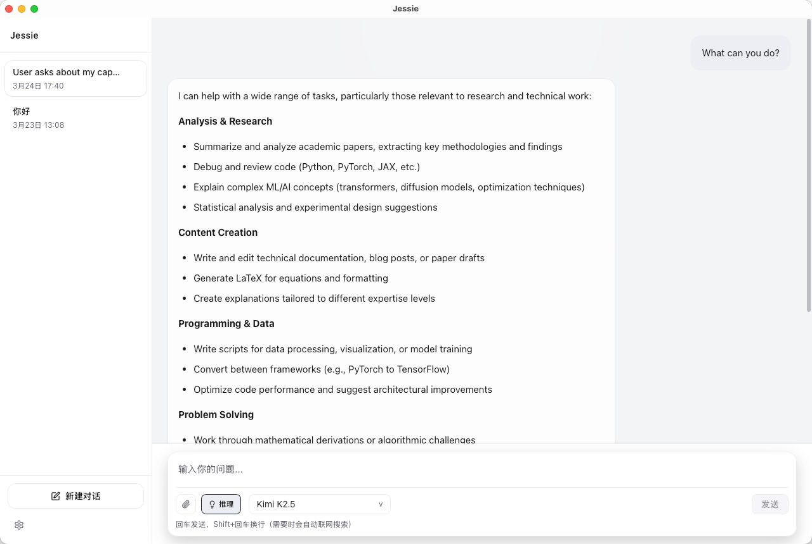

# Jessie

A minimal, OpenRouter-based desktop AI chat client built for daily serious work.

<p align="center">
  
</p>

<p align="center">
  
  
  
  
  
</p>

<details open>
<summary><strong>English</strong></summary>

## Table of Contents

1. [What Jessie Is](#what-jessie-is)
2. [Why Jessie Exists](#why-jessie-exists)
3. [Jessie vs Generic Chat Clients](#jessie-vs-generic-chat-clients)
4. [What OpenRouter Unlocks](#what-openrouter-unlocks)
5. [Product Strengths](#product-strengths)
6. [Screenshots](#screenshots)
7. [Run as a Desktop App (Production)](#run-as-a-desktop-app-production)
8. [Real Workflow Scenarios](#real-workflow-scenarios)
9. [Memory System (Quality-First)](#memory-system-quality-first)
10. [Tooling](#tooling)
11. [Non-Goals](#non-goals)
12. [Quick Start](#quick-start)

## What Jessie Is

Jessie is a **local-first desktop AI client** built with **Tauri + React + TypeScript**.  
It focuses on one thing: making AI chat reliable and genuinely useful in real workflows.

Core principles:

1. High signal, low noise
2. Minimal but powerful UX
3. Real tool execution (no fake capabilities)
4. Explicit reliability boundaries

## Why Jessie Exists

Many chat apps are impressive in demos but weak in daily work:

1. They forget your durable context.
2. They hide failures behind vague messages.
3. They overcomplicate settings but underdeliver utility.
4. They make model choice rigid or provider-locked.

Jessie is designed to solve these problems with a practical, local-first architecture.

## Jessie vs Generic Chat Clients

| Capability | Jessie | Generic Chat Client |
| --- | --- | --- |
| Model ecosystem | OpenRouter-based multi-model access from one app | Often tied to one provider or narrow model choices |
| Task-level model routing | Pick different models for drafting, reasoning, and finalization | Usually one model strategy for everything |
| Real web search | Tavily is executed as an actual tool call | Often prompt-level “I can browse” behavior without true calls |
| External tools | MCP host (stdio + remote HTTP, with fallback) | Limited, fixed integrations |
| Memory quality | Conservative extraction + semantic gating + dedupe/supersede | Frequently stores noisy conversation fragments |
| Reliability visibility | Typed errors with clear user-facing messages | “No content” or opaque failures are common |
| Failure isolation | Tool/memory/title failures do not collapse core response path | Subsystem failures often break the whole flow |
| Privacy posture | Local-first persistence by default | Commonly cloud-first by default |
| Product complexity | Minimal UI with focused controls | Feature-heavy but higher cognitive load |

## What OpenRouter Unlocks

Jessie is not just “compatible with OpenRouter.” It is **OpenRouter-based by design**.

1. One integration, broad model coverage
   - Switch model families without changing your workflow.
2. Better decisions per task
   - Use faster/cheaper models for drafting, stronger models for difficult reasoning.
3. Practical quality-speed-cost control
   - Make explicit tradeoffs instead of relying on one global default.
4. Lower lock-in risk
   - Your app workflow stays stable even if your preferred model stack changes.
5. Better orchestration with tools and memory
   - Model calls, tool calls, and memory injection stay in one coherent pipeline.

## Product Strengths

1. Minimal, high-clarity UI
   - Clean interaction surfaces and reduced cognitive noise.
2. Fast and smooth interaction loop
   - Streaming chat with responsive desktop UX.
3. Local-first data model
   - Chats, settings, and memory persist locally.
4. Reliability-first behavior
   - Non-critical subsystem failures are isolated.
5. Honest capability boundaries
   - No fabricated web results and no hidden tool failures.

## Screenshots

Main window preview:



## Run as a Desktop App (Production)

You do not need to run Jessie in dev mode every time. Build a production app once, then launch it like a normal macOS application.

1. Build the app bundle

```bash
npm install
npm run tauri:build
```

2. Locate build output (macOS)
   - DMG: `src-tauri/target/release/bundle/dmg/`
   - APP bundle: `src-tauri/target/release/bundle/macos/`
3. Install
   - Open the generated `.dmg` and drag `Jessie.app` into `Applications`.
4. Launch Jessie from `Applications` (or Spotlight), no terminal required.
5. If macOS blocks first launch
   - Open `System Settings > Privacy & Security` and click `Open Anyway` for Jessie.

API key persistence note:

1. OpenRouter/Tavily keys and settings are saved locally by the app.
2. After packaging and normal launch, you do not need to re-enter keys on every start.
3. Data remains local to your machine unless you explicitly share/export it.

## Real Workflow Scenarios

1. Research workflow
   - Ask a time-sensitive question.
   - Model triggers `web_search`; Jessie calls Tavily and feeds tool output back into generation.
   - If search fails, the user gets a clear error instead of hallucinated “live data.”
2. Engineering workflow
   - Draft with a fast model, then switch to a stronger reasoning model for review.
   - Durable preferences are retained through memory and reused in later sessions.
3. MCP Apps workflow
   - Connect MCP servers (for example, Excalidraw MCP).
   - Use discovered tools through Jessie’s tool-calling path.
   - When app resources exist, render embedded app views in chat.

## Memory System (Quality-First)

Jessie memory is intentionally conservative: better to miss weak memory than store junk.

1. Allowed durable categories
   - Preference
   - Identity fact
   - Long-term project context
   - Standing instruction
2. Rejected categories
   - One-off tasks
   - Temporary plans
   - Generic Q&A fragments
   - Assistant-style output text
3. Quality controls
   - Explicit semantic gating before persistence
   - Near-duplicate detection and merging
   - Supersede policy for updated preferences/facts
4. Efficiency controls
   - Memory path is English-normalized
   - Chinese user input is translated to English for retrieval/injection
   - Long memories are LLM-compressed and cached

## Tooling

### Tavily Web Search

1. Model emits tool call (`web_search`).
2. Jessie calls Tavily Search API.
3. Tool result returns as tool message.
4. Model continues generation.

If Tavily is unavailable, Jessie fails clearly and does not fabricate search output.

### MCP (Host v1)

Supported:

1. Local stdio MCP servers
2. Remote HTTP MCP servers (Streamable HTTP with legacy SSE fallback)
3. Tool discovery, namespacing, and execution
4. MCP app resource rendering in chat when available

Remote MCP security baseline:

1. HTTPS only
2. Domain allowlist
3. Per-server custom headers

## Non-Goals

Jessie deliberately avoids:

1. Fake tool/web capabilities
2. Overloaded “control panel” settings UX
3. Silent failure masking
4. Over-engineered architecture beyond practical needs

## Tech Stack

1. Tauri 2
2. React + TypeScript + Vite
3. Zustand
4. TailwindCSS
5. OpenRouter Chat Completions API
6. Tavily Search API
7. MCP host runtime (frontend + Rust backend)

## Quick Start

```bash
npm install
npm run tauri:dev
```

## Build

```bash
npm run build
npm run test
npm run tauri:build
```

## Required Settings

Configure in-app settings:

1. OpenRouter API Key
2. Tavily API Key (for web search)

## Main Modules

1. `src/store/useChatStore.ts` — chat pipeline, streaming, tool loop, reliability boundaries
2. `src/store/useMemoryStore.ts` — memory import/extract/retrieve/injection/compression
3. `src/lib/memoryQuality.ts` — explicit memory quality gating
4. `src/lib/openrouter.ts` — OpenRouter request layer
5. `src/lib/mcpHost.ts` + `src-tauri/src/mcp.rs` — MCP runtime/discovery/execution
6. `src/components/settings/*` — settings experience

## Security Notes

1. Never commit real API keys.
2. Keep `.env*` and private exports out of version control.
3. Report vulnerabilities via `SECURITY.md`.

## License

MIT. See [LICENSE](./LICENSE).

</details>

<details>
<summary><strong>简体中文</strong></summary>

## 目录

1. Jessie 是什么
2. 为什么要做 Jessie
3. Jessie vs 普通聊天客户端
4. OpenRouter 带来的核心能力
5. 产品核心优势
6. 截图
7. 以桌面 App 形式运行（生产环境）
8. 真实工作流场景
9. 记忆系统（质量优先）
10. 工具能力
11. Non-Goals / 边界声明
12. 快速开始

## Jessie 是什么

Jessie 是一个 **本地优先（local-first）** 的桌面 AI 聊天客户端，基于 **Tauri + React + TypeScript**。  
它的目标很明确：让 AI 对话在真实日常工作中更可靠、更高效。

核心原则：

1. 高信号、低噪音
2. 极简但高效的交互
3. 工具能力真实可执行（不是提示词“假功能”）
4. 可靠性边界清晰可见

## 为什么要做 Jessie

很多 AI 聊天产品“演示很好看，日用不顺手”，典型问题是：

1. 缺少长期上下文，聊几轮就“失忆”。
2. 失败信息模糊，排错成本高。
3. 设置项很多，但有效能力不成体系。
4. 模型选择僵化，容易被单一厂商绑定。

Jessie 用务实的本地架构，专门解决这些高频痛点。

## Jessie vs 普通聊天客户端

| 能力项 | Jessie | 普通聊天客户端 |
| --- | --- | --- |
| 模型生态 | 基于 OpenRouter 统一接入多模型 | 常见为单一厂商或少量固定模型 |
| 任务级模型路由 | 可按“起草/推理/定稿”阶段选不同模型 | 往往一套模型策略覆盖所有场景 |
| 联网检索真实性 | Tavily 真实工具调用 | 常见是提示词层“可联网”，不可验证 |
| 外部工具扩展 | MCP Host（stdio + 远程 HTTP，含回退） | 集成能力通常较固定 |
| 记忆质量 | 严格提取门控 + 去重 + 可覆盖更新 | 容易沉淀噪音对话片段 |
| 可靠性可观测 | Typed error + 明确用户提示 | 常见“无内容返回/未知错误” |
| 故障隔离 | 工具/记忆/标题失败不拖垮主回复 | 子系统失败可能连带影响全链路 |
| 隐私姿态 | 默认本地优先持久化 | 常见云优先 |
| 产品复杂度 | 极简 UI、关键控制集中 | 功能堆叠但认知负担更高 |

## OpenRouter 带来的核心能力

Jessie 不是“顺便支持 OpenRouter”，而是 **以 OpenRouter 为能力底座**。

1. 单次集成，覆盖多模型生态
   - 不改工作流即可切换模型家族与提供方。
2. 按任务选择模型
   - 起草用更快更省的模型，关键推理切到更强模型。
3. 质量/速度/成本可实际权衡
   - 不再被一个全局默认模型绑定全部任务。
4. 降低厂商锁定风险
   - 模型偏好变化时，产品使用路径保持稳定。
5. 与工具和记忆链路协同
   - 模型调用、工具调用、记忆注入在同一主链路闭环。

## 产品核心优势

1. 极简且高辨识度的 UI 交互
   - 页面干净，减少无效信息和操作干扰。
2. 快速流畅的对话反馈
   - 流式输出 + 桌面端响应体验。
3. 本地优先数据模型
   - 聊天、设置、记忆都在本地持久化。
4. 可靠性优先
   - 非关键子系统异常不会拖垮主对话。
5. 能力边界诚实
   - 不伪造联网结果，不掩盖工具失败。

## 截图

主界面预览：


## 以桌面 App 形式运行（生产环境）

你不需要每次都在开发环境启动 Jessie。打一次生产包后，就可以像普通 macOS 应用一样直接打开。

1. 构建安装包

```bash
npm install
npm run tauri:build
```

2. 构建产物位置（macOS）
   - DMG：`src-tauri/target/release/bundle/dmg/`
   - APP 包：`src-tauri/target/release/bundle/macos/`
3. 安装
   - 打开生成的 `.dmg`，把 `Jessie.app` 拖到 `Applications`。
4. 后续可直接从 `Applications` 或 Spotlight 启动，无需终端。
5. 如果首次打开被 macOS 拦截
   - 进入 `系统设置 > 隐私与安全性`，对 Jessie 选择 `仍要打开`。

API Key 保存说明：

1. OpenRouter/Tavily Key 和设置会由应用在本地持久化。
2. 打包后正常使用时，不需要每次重输 Key。
3. 数据默认保留在本机，除非你主动导出或分享。

## 真实工作流场景

1. 研究场景
   - 询问时效性问题。
   - 模型触发 `web_search`，Jessie 调用 Tavily 并将结果回注模型。
   - 若搜索失败，给出清晰报错，而不是“假装已联网”。
2. 工程场景
   - 用快模型起草，再切到强推理模型做审阅与收敛。
   - 长期偏好通过记忆保留并跨会话复用。
3. MCP Apps 场景
   - 连接 MCP server（例如 Excalidraw MCP）。
   - 通过 Jessie 的工具调用链路执行外部工具。
   - 若 server 提供 app 资源，可在聊天中内嵌展示。

## 记忆系统（质量优先）

Jessie 的记忆策略是“宁缺毋滥”：宁可少记，也不存垃圾。

1. 允许入库的长期信息
   - 用户偏好
   - 身份事实
   - 长期项目上下文
   - 长期指令
2. 明确拒绝的内容
   - 一次性任务
   - 临时计划
   - 泛化问答片段
   - 助手口吻输出文本
3. 质量控制机制
   - 入库前显式语义门控
   - 近重复检测与合并
   - 新事实可覆盖旧偏好/旧版本
4. Token 效率机制
   - 记忆链路统一英文表示
   - 中文输入会先转英文用于检索/注入
   - 超长记忆由 LLM 精简并缓存

## 工具能力

### Tavily 联网搜索

1. 模型触发 `web_search`。
2. Jessie 调用 Tavily Search API。
3. 结果以 tool message 回传。
4. 模型继续生成最终回答。

若 Tavily 不可用，Jessie 会明确失败并保持诚实边界，不伪造联网内容。

### MCP（Host v1）

已支持：

1. 本地 stdio MCP server
2. 远程 HTTP MCP server（优先 Streamable HTTP，自动回退 legacy SSE）
3. 工具发现、命名规避、执行回传
4. 有 app 资源时在聊天中渲染 MCP App 视图

远程 MCP 安全基线：

1. 仅 HTTPS
2. 域名白名单
3. 每个 server 可配置独立 Header

## Non-Goals / 边界声明

Jessie 明确不做：

1. 假工具能力或伪联网结果
2. 过度复杂的“控制台式”设置页面
3. 静默吞错与失败掩盖
4. 脱离实际需求的过度工程化

## 技术栈

1. Tauri 2
2. React + TypeScript + Vite
3. Zustand
4. TailwindCSS
5. OpenRouter Chat Completions API
6. Tavily Search API
7. MCP Host Runtime（前端 + Rust 后端）

## 快速开始

```bash
npm install
npm run tauri:dev
```

## 构建

```bash
npm run build
npm run test
npm run tauri:build
```

## 必要配置

请在设置中配置：

1. OpenRouter API Key
2. Tavily API Key（用于联网搜索）

## 关键模块

1. `src/store/useChatStore.ts`：对话主链路、流式输出、工具循环、可靠性边界
2. `src/store/useMemoryStore.ts`：记忆导入/提取/召回/注入/压缩
3. `src/lib/memoryQuality.ts`：记忆质量门控
4. `src/lib/openrouter.ts`：OpenRouter 请求层
5. `src/lib/mcpHost.ts` + `src-tauri/src/mcp.rs`：MCP 运行时/发现/执行
6. `src/components/settings/*`：设置交互层

## 安全说明

1. 不要提交真实 API Key。
2. `.env*` 和私有导出数据不要入库。
3. 安全问题请按 `SECURITY.md` 流程反馈。

## License

MIT，详见 [LICENSE](./LICENSE)。

</details>
